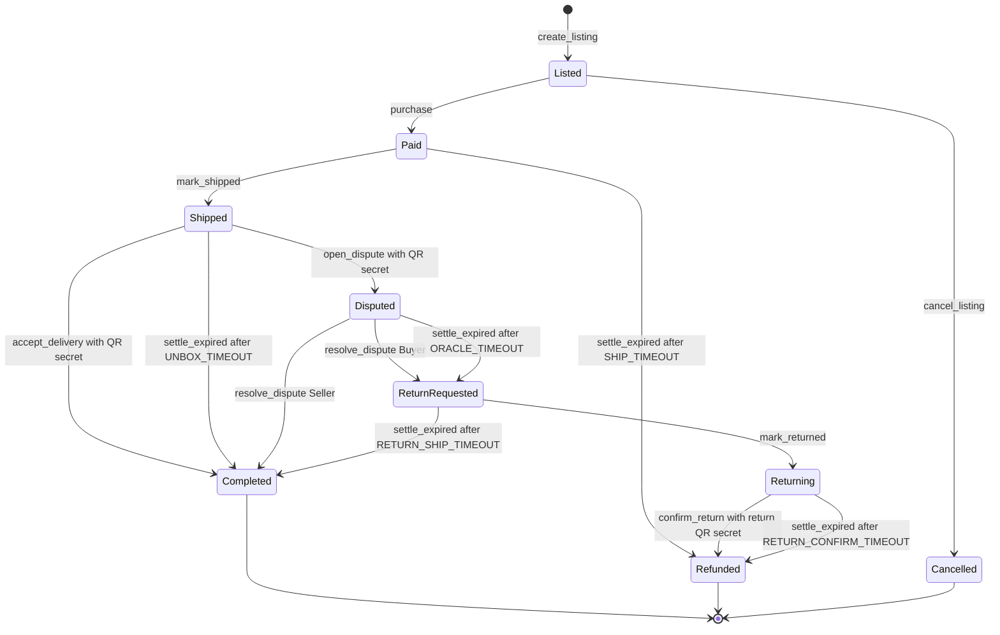

# Sellsor

**A second-hand clothes marketplace on Solana where an on-chain escrow and a narrow AI oracle replace the platform's "buyer protection" fee.**

The buyer's money sits in a program anyone can read, not with a company. The seller films the packing with a single-use QR card, and the buyer films the unboxing. If the buyer complains, an AI oracle reviews both videos and can do exactly one thing on-chain: pick a side. After every deadline anyone can close the deal according to a fixed table, so nobody, including us, can freeze or redirect the funds.

| | |
|---|---|
| Program (devnet) | [`CEoTTEq46mxFrNqPu9EbpFbDshsrSTZV9GB14XPT1Nyq`](https://explorer.solana.com/address/CEoTTEq46mxFrNqPu9EbpFbDshsrSTZV9GB14XPT1Nyq?cluster=devnet) |
| Landing | [vibecourses.co/sellsor](https://vibecourses.co/sellsor/) |
| Video (3 min) | TODO |
| Slides (PDF) | TODO |

HackYeah 2026 · Superteam Poland challenge **"Finance without intermediaries"**

**Team SoldSouls:** Maciej Łazarczyk, Marta Majewska, Ihnat Vyhuliar, Tomasz Żurawski, Mateusz Żurawski

---

## Contents

- [Who it is for](#who-it-is-for)
- [Design rationale](#design-rationale)
- [How it works](#how-it-works)
- [State machine](#state-machine)
- [Where the intermediary disappears](#where-the-intermediary-disappears)
- [The narrow AI oracle](#the-narrow-ai-oracle)
- [Demo](#demo)
- [Project status](#project-status)
- [Repository map](#repository-map)
- [Running it](#running-it)
- [Stack](#stack)
- [Trust model and known limitations](#trust-model-and-known-limitations)
- [Next steps](#next-steps)
- [Jury FAQ](#jury-faq)

## Who it is for

**People who buy and sell used clothes online (Vinted / OLX users) and have never touched crypto.**

This user decided two things:

- **No jargon in the UI.** The app (in Polish) says "funds secured in the agreement", "balance" and "refund", never "on-chain transaction", "signature", "lamport" or "PDA". A "View in Solana Explorer" link is always there, but kept low-key.
- **Embedded wallet instead of Wallet Adapter.** A Vinted user does not have Phantom. The app generates a keypair on first launch and keeps it in `expo-secure-store` ([`app/src/solana/wallet.ts`](app/src/solana/wallet.ts)). The challenge rules allow either approach if the choice is justified. Because the wallet signs in the background, every irreversible step has its own consent screen.

## Design rationale

**The financial relationship:** a buyer pays a stranger for a used piece of clothing bought online.

**The intermediary today:** the platform. It holds the money, charges a "buyer protection" fee on every purchase (a fixed amount plus a percentage of the price), and its support team resolves complaints by hand, using rules the parties cannot see or enforce.

**What changes once it is removed:**

- The money is held by a program whose code anyone can read.
- The deployed program enforces the same deadlines and permissions for everyone. On devnet the program is still upgradeable; production would remove the upgrade authority.
- Disputes are settled by an AI oracle with a **binary** power: buyer or seller. It cannot take the funds or freeze them, because after its deadline anyone can close the deal.
- The evidence (listing hash, video hashes, QR commitment) is written on-chain with a timestamp.
- The user pays the network fee and the rent deposit for the `Deal` account (see [limitations](#trust-model-and-known-limitations)). We pay for the oracle's Gemini tokens.

## How it works

1. **List.** The seller adds photos, a description, size, brand, condition, **a list of defects** and a price in SOL. `server/` freezes the content as `metadata.json`, and its sha256 goes into the `Deal` account (`create_listing`). After the sale the description cannot change.
2. **Buy.** The buyer's SOL moves into escrow in the `Deal` account (`purchase`). The buyer signs the exact listing hash and the arbiter key they were shown.
3. **Pack and ship.** The seller generates a single-use QR card, films the packing in the app (item, QR card going in, sealing, carrier label), uploads the video and calls `mark_shipped(qr_commitment, video_hash, tracking_number)`.
4. **Unbox.** The buyer films the whole opening in the app, starting from the sealed parcel. The QR card only becomes visible once the parcel is open. Right after recording, the buyer chooses:
   - **"Everything OK"** → `accept_delivery(qr_secret)` → SOL to the seller. The video is not uploaded.
   - **"I have a complaint"** → upload the video and `complaint.json` → `open_dispute(qr_secret, video_hash, complaint_hash)`.
   - Nothing before `UNBOX_TIMEOUT` → anyone calls `settle_expired` → SOL to the seller. **No video, no complaint.**
5. **Dispute.** The oracle checks the evidence hashes, asks Gemini to fill a structured report, computes the verdict in code and calls `resolve_dispute`: `Seller` pays the seller, `Buyer` moves the deal to `ReturnRequested`.
6. **Return.** The buyer films packing the return with a **new** QR card and calls `mark_returned`. The seller scans it, `confirm_return(return_qr_secret)` refunds the buyer. If the seller stays silent, `settle_expired` refunds the buyer after `RETURN_CONFIRM_TIMEOUT`.

**Single-use QR.** The secret is 32 random bytes from the seller's phone. Payloads: `UNBOX1:<deal>:<secret>` for shipping and `UNBOX1R:<deal>:<secret>` for the return. Commitments are `sha256(deal || secret)` and `sha256("return" || deal || secret)` ([`logic.rs#L9-L16`](programs/unbox_escrow/src/logic.rs#L9-L16)). The secret is revealed in the same transaction as the buyer's decision, and the status change makes it unusable afterwards. The seller knows the secret, but only the buyer can sign `accept_delivery` / `open_dispute`.

**Evidence storage.** Files live in `server/` `/media`, addressed by their sha256 (`GET /media/<sha256>`). The hash on-chain is the file's address, and files are immutable.

## State machine



`Completed` means the SOL went to the seller, `Refunded` means it went back to the buyer. Every status change emits a `DealStatusChanged` event ([`state.rs#L60-L64`](programs/unbox_escrow/src/state.rs#L60-L64)).

### Permissions

| Instruction | Signer | From status | Conditions |
|---|---|---|---|
| `create_listing` | seller | — | `price > 0`, listing hash ≠ 0, arbiter given explicitly |
| `cancel_listing` | seller | `Listed` | — |
| `purchase(expected_listing_hash, expected_arbiter)` | buyer ≠ seller | `Listed` | both arguments match the account, so the buyer explicitly accepts the arbiter |
| `mark_shipped` | seller | `Paid` | before `SHIP_TIMEOUT`; QR commitment and video hash ≠ 0; tracking number 1–32 chars |
| `accept_delivery(qr_secret)` | buyer | `Shipped` | before `UNBOX_TIMEOUT`; QR commitment matches |
| `open_dispute(qr_secret, video_hash, complaint_hash)` | buyer | `Shipped` | same, plus both hashes ≠ 0 |
| `resolve_dispute(verdict, report_hash)` | `deal.arbiter` | `Disputed` | before `ORACLE_TIMEOUT`; verdict is `Seller` or `Buyer`; report hash ≠ 0 |
| `mark_returned` | buyer | `ReturnRequested` | before `RETURN_SHIP_TIMEOUT`; return QR commitment and video hash ≠ 0; tracking number 1–32 chars |
| `confirm_return(return_qr_secret)` | seller | `Returning` | before `RETURN_CONFIRM_TIMEOUT`; return QR commitment matches |
| `settle_expired` | **anyone** | see below | `now >= status_changed_at + timeout` |

### `settle_expired`: nobody has to watch over the deal

| Status | Deadline (production / `demo` build) | Result | Meaning |
|---|---|---|---|
| `Paid` | `SHIP_TIMEOUT` 3 days / 10 min | `Refunded` | seller vanished, buyer gets the SOL back |
| `Shipped` | `UNBOX_TIMEOUT` 7 days / 60 min | `Completed` | no video or decision, seller gets the SOL |
| `Disputed` | `ORACLE_TIMEOUT` 24 h / 10 min | `ReturnRequested` | oracle is silent, so goods go back for the money |
| `ReturnRequested` | `RETURN_SHIP_TIMEOUT` 3 days / 10 min | `Completed` | buyer did not send it back, seller gets the SOL |
| `Returning` | `RETURN_CONFIRM_TIMEOUT` 7 days / 10 min | `Refunded` | seller did not confirm, buyer gets the SOL back |

Party actions require `now < deadline`, while `settle_expired` requires `now >= deadline`, so there is no race at the boundary. The time is the network clock (`Clock` sysvar), not the phone's. Timeouts live in [`constants.rs`](programs/unbox_escrow/src/constants.rs). The `demo` feature is on by default for the hackathon, and `test-timeouts` (5 s each) is used only by the test suite.

## Where the intermediary disappears

Everything that touches money, deadlines or permissions is enforced in [`programs/unbox_escrow`](programs/unbox_escrow/src). The app, `server/` and the oracle only submit transactions or mirror state.

| Rule | Code |
|---|---|
| The whole public surface: 10 instructions, **no admin instruction**, no path that moves funds outside the state machine | [`lib.rs#L19-L81`](programs/unbox_escrow/src/lib.rs#L19-L81) |
| The buyer cannot be the seller and signs the exact listing hash and arbiter they were shown; the price moves into the `Deal` account | [`purchase.rs#L27-L40`](programs/unbox_escrow/src/instructions/purchase.rs#L27-L40) |
| Delivery is accepted only with the QR secret from inside the parcel; the payout goes only to the stored seller | [`accept_delivery.rs#L28-L34`](programs/unbox_escrow/src/instructions/accept_delivery.rs#L28-L34) |
| A complaint needs the same QR secret plus non-empty video and complaint hashes | [`open_dispute.rs#L29-L34`](programs/unbox_escrow/src/instructions/open_dispute.rs#L29-L34) |
| The arbiter acts only on `Disputed`, only before `ORACLE_TIMEOUT`, only with `Seller` or `Buyer`; `Buyer` pays no one, it only starts the return | [`resolve_dispute.rs#L28-L44`](programs/unbox_escrow/src/instructions/resolve_dispute.rs#L28-L44) |
| The return is confirmed only with the return QR (different hash prefix, so the shipping secret does not work) | [`confirm_return.rs#L28-L34`](programs/unbox_escrow/src/instructions/confirm_return.rs#L28-L34) |
| **Anyone** closes an expired deal; payees are pinned to the stored seller and buyer | [`settle_expired.rs#L8-L49`](programs/unbox_escrow/src/instructions/settle_expired.rs#L8-L49) |
| The expiry table and the `now < deadline` / `now >= deadline` split | [`logic.rs#L41-L57`](programs/unbox_escrow/src/logic.rs#L41-L57) |

Tests for each path, including substituted payees, replayed QR secrets, a foreign arbiter and deadline boundaries: [`tests/unbox_escrow.test.ts`](tests/unbox_escrow.test.ts), [`tests/dispute.test.ts`](tests/dispute.test.ts), [`tests/escrow-client.test.ts`](tests/escrow-client.test.ts) (34 cases on Surfpool), plus Rust unit tests in [`logic.rs`](programs/unbox_escrow/src/logic.rs#L70).

## The narrow AI oracle

The oracle ([`oracle/`](oracle)) **reports facts, it does not decide about money**. Its key is `deal.arbiter`, set at `create_listing` and accepted by the buyer at `purchase`. On-chain it can only call `resolve_dispute` as described above.

Pipeline:

1. **Watch** ([`watch.ts`](oracle/src/watch.ts)): polls `Deal` accounts in `Disputed` every ~5 s. Optionally it also calls `settle_expired` on expired deals as a convenience (`CRANK=off` disables it; anyone can do it).
2. **Evidence** ([`evidence.ts`](oracle/src/evidence.ts)): downloads `metadata.json`, photos, both videos and `complaint.json`, and compares the sha256 of the exact bytes with the on-chain hashes. **A missing or mismatched file loses the case for its author, without calling the model.**
3. **Gemini** ([`gemini.ts`](oracle/src/gemini.ts)): both videos via the Files API, plus photos, description with the defect list and the complaint. The output is constrained by a JSON schema. The prompt is versioned in [`oracle/prompts/`](oracle/prompts) and tells the model to treat weak, cut or obscured recordings as evidence against their author.
4. **Decide** ([`decide.ts`](oracle/src/decide.ts)): **the verdict comes from a deterministic function, not from the model.** The model only fills the report fields:

   ```ts
   const b = r.buyer_recording, s = r.seller_recording;
   const buyerOk = b.continuous && b.starts_with_sealed_package && b.qr_revealed_on_opening && b.quality === "good";
   if (!buyerOk) return "SELLER";
   const sellerOk = s.quality === "good" && s.item_clearly_visible && s.qr_card_packed;
   if (sellerOk && !r.package_matches_shipping_recording) return "SELLER"; // package differs from shipped one → tampering
   if (!r.item_matches_listing || r.undisclosed_damage.present) return "BUYER";
   return "SELLER";
   ```

5. **Resolve** ([`resolve.ts`](oracle/src/resolve.ts)): uploads `report.json` (with `model` and `prompt_version`) to `/media` and sends `resolve_dispute(verdict, sha256(report.json))`. Anyone can download the report by that hash, verify it and re-run `decide()` on its fields.

If the oracle is down or silent, the program does not wait for it: after `ORACLE_TIMEOUT`, `settle_expired` moves the deal to the neutral return path.

Test cases with expected verdicts live in [`oracle/fixtures/`](oracle/fixtures): `ok`, `stain` (undisclosed damage), `cut` (unboxing starts from an opened box), `disclosed` (stain is on the defect list) and `swap` (another shirt on the table before opening).

## Demo

**What sends real transactions today:** the program on devnet, [`unbox-cli`](cli/) and the app's Solana client [`app/src/solana/`](app/src/solana/) (`SolanaEscrow`). **The app screens and the web build on the landing are a UI simulation:** they run the prototype's demo engine in [`app/src/AppProvider.tsx`](app/src/AppProvider.tsx), so tapping a button there does **not** send a Solana transaction, and their Explorer links point to made-up signatures. Until the screens are wired to `SolanaEscrow`, the CLI is the way to drive the real program (see [Running it](#running-it)).

The planned live demo, once the screens are wired, uses two phones (seller and buyer) on devnet:

- **Deal A, dispute.** A parcel with a printed QR card and a shirt with an **undisclosed stain**, staged in `Shipped` shortly before the presentation. Live: film the unboxing, file a complaint, show the AI verdict with its rule path, open `resolve_dispute` in Solana Explorer.
- **Deal B, happy path.** List and buy live, then "Everything OK" and the payout in Explorer.
- **The moment the intermediary disappears.** A deal in `Paid` whose `SHIP_TIMEOUT` has passed. The buyer presses "Odbierz środki" ("Claim funds"), which calls `settle_expired`. Nobody has to agree.

| Step | Transaction |
|---|---|
| `create_listing` | TODO |
| `purchase` | TODO |
| `mark_shipped` | TODO |
| `accept_delivery` | TODO |
| `open_dispute` | TODO |
| `resolve_dispute` | TODO |
| `settle_expired` | TODO |

The table stays empty until a devnet run on the current program build is confirmed; we do not list transactions we have not verified.

## Project status

| Part | State |
|---|---|
| On-chain program | Full state machine with all 10 instructions; `demo` build on devnet; 34 integration tests on Surfpool + Rust unit tests |
| `unbox-cli` | Drives the whole flow on devnet from keypair files (publish, buy, ship, accept, dispute, return, confirm-return, settle); backup demo without a phone |
| Oracle | Evidence hash checks, Gemini report, `decide()`, `resolve_dispute`, optional crank; unit tests for `decide`, evidence, crank and resolve |
| `server/` | Accounts, listings, media store addressed by sha256; in `PAYMENTS=solana` it mirrors `Deal` accounts read from RPC and holds no keys |
| App wallet + `SolanaEscrow` (`app/src/solana/`) | Implemented and tested against Surfpool through the shared `Escrow` interface |
| App screens | Still run the prototype's demo engine (`app/src/AppProvider.tsx`, mocked transactions, local listings, simulated AI verdict); they do not call `app/src/solana/` yet, so UI actions send no Solana transactions. Wiring them to `SolanaEscrow` is in progress |
| Landing + web build of the app | Live at [vibecourses.co/sellsor](https://vibecourses.co/sellsor/); the web build is a UI simulation on the same mocked engine, not a devnet client |

## Repository map

```
programs/unbox_escrow/   Anchor program: the escrow and the state machine (the intermediary disappears here)
tests/                   program tests (TypeScript, Surfpool), one per path of the state machine
packages/shared/         IDL, shared types, QR commitments, Polish status labels, the Escrow interface
app/                     React Native (Expo) app; app/src/solana/ is the only place that imports web3/anchor
oracle/                  Gemini oracle + optional settle_expired crank; prompts/ and fixtures/
server/                  Rust (axum + SQLite): accounts, listings, media; mirrors the program in PAYMENTS=solana
cli/                     unbox-cli: the full flow from keypair files, without a phone
scripts/                 backend contract test
landing/                 landing page and the web build of app/ for vibecourses.co/sellsor
docs/                    UI spec (ui.md), task breakdown, integration plans
CLAUDE.md                full project spec (Polish): state machine, permissions, oracle, decisions log
```

Component READMEs: [`server/README.md`](server/README.md) (API contract, `PAYMENTS=solana`, Helius webhook), [`oracle/README.md`](oracle/README.md), [`app/README.md`](app/README.md), [`landing/README.md`](landing/README.md).

## Running it

**Devnet only.** Never commit `.env` files or keypairs; each part has an `.env.example`.

Prerequisites:

- Node 24 and pnpm 9.15.9 (`packageManager` in `package.json`). Run `pnpm install` on the host, not inside the container.
- Docker, for the program toolchain (Anchor 1.1.2, Solana CLI, Rust 1.95, Surfpool): the dev container in [`.devcontainer/`](.devcontainer), based on the Superteam bootcamp image. Only the program, `server/` and `cli/` need Rust.
- Expo Go on a phone for the app.

```bash
pnpm install                                  # host
```

**Program** (inside the dev container):

```bash
anchor build                                  # demo profile (minute timeouts)
pnpm test:program                             # rebuilds with test-timeouts and runs tests/ on Surfpool
pnpm sync-idl                                 # copies the IDL and types into packages/shared
DEPLOY_URL=<devnet RPC> pnpm deploy:devnet    # program owner only; always rebuilds without test-timeouts
```

**Backend** (`server/`, port 4000):

```bash
ARBITER_PUBKEY=<oracle pubkey> pnpm dev:server   # PAYMENTS=solana by default; RPC_URL defaults to public devnet
PAYMENTS=demo pnpm dev:server                    # offline SQLite ledger, tests and fallback demo only
pnpm test:backend
```

Set `PUBLIC_BASE_URL` to a stable LAN address before publishing listings, because it ends up on-chain in `metadata_uri`. See [`server/.env.example`](server/.env.example).

**Oracle:**

```bash
cp oracle/.env.example oracle/.env            # GEMINI_API_KEY, GEMINI_MODEL, ORACLE_KEYPAIR, RPC_URL, API_URL, ORACLE_API_*
pnpm --filter oracle test
pnpm --filter oracle fixture fixtures/stain   # model + decide() on local files, no chain
pnpm --filter oracle dev                      # the loop
```

**App:**

```bash
cp app/.env.example app/.env                  # EXPO_PUBLIC_API_URL (laptop LAN IP), EXPO_PUBLIC_RPC_URL, EXPO_PUBLIC_ORACLE_PUBKEY
pnpm --filter app start                       # scan with Expo Go
```

The screens currently run the demo engine (see [Demo](#demo)); `EXPO_PUBLIC_RPC_URL` and `EXPO_PUBLIC_ORACLE_PUBKEY` are read by `app/src/solana/`, while `EXPO_PUBLIC_API_URL` and `EXPO_PUBLIC_PAYMENTS` are not read by the current UI yet.

**CLI** (no phone needed; global flags go before the subcommand):

```bash
cd cli
export RPC_URL=<devnet RPC> API_URL=http://localhost:4000 ARBITER_PUBKEY=<oracle pubkey>
cargo run -- --keypair seller.json --email ania@demo.pl link
cargo run -- --keypair seller.json --email ania@demo.pl publish --listing l-kurtka-levis
cargo run -- --keypair buyer.json --email bartek@demo.pl link
cargo run -- --keypair buyer.json --email bartek@demo.pl buy --listing l-kurtka-levis
cargo run -- --keypair seller.json --email ania@demo.pl ship --listing l-kurtka-levis --tracking INP123 --video packing.mp4
cargo run -- --keypair buyer.json --email bartek@demo.pl accept --qr 'UNBOX1:<deal>:<secret>'
cargo run -- --help                           # dispute, return, confirm-return, settle, show
```

Demo accounts in `server/` use the password `demo1234`: `ania@demo.pl` sells, `bartek@demo.pl` buys.

## Stack

| Layer | Choice |
|---|---|
| Program | Anchor 1.1.2, Rust 1.95, Solana CLI from the Superteam dev container (`quay.io/ottersec/anchor:v1.1.2`) |
| Local validator | Surfpool (tests move its clock with `surfnet_timeTravel`) |
| TS client | `@anchor-lang/core` 1.1.2 + `@solana/web3.js` 1.99.0, pinned via `pnpm.overrides` |
| App | Expo SDK 57, React Native 0.86, TypeScript; embedded wallet in `expo-secure-store` |
| Oracle | Node 24, TypeScript, `@google/genai` (model set by `GEMINI_MODEL`) |
| Backend | Rust, axum, SQLite; media addressed by sha256 |

## Trust model and known limitations

We would rather state these openly:

- **Rent deposit.** The `Deal` account (663 B, about 0.0055 SOL) is paid by the seller at listing time and is not returned today, not even after cancellation. With prices of 0.03–0.09 SOL that is a noticeable share of the price.
- **A single arbiter key** is residual trust. It is limited to choosing a side in `Disputed` before its deadline and cannot move funds to anyone but the two parties.
- **A modified client can submit a crafted video.** There is no device attestation yet.
- **File availability depends on `server/`.** The on-chain hashes prove integrity, not availability.
- **The seller cannot contest a return.**
- **SOL price is volatile.**
- **The tracking number is not verified.**
- **The wallet key exists only on the phone.** Losing the phone or deleting the app means losing the funds.
- **Recordings are public.** A file's address is its sha256 stored on-chain, so anyone who reads a `Deal` account can download it.
- **Filming every unboxing is extra effort for the buyer.** That is the price of having no intermediary.
- **The program does not itself forbid `seller == arbiter`.** On-chain, `purchase(expected_listing_hash, expected_arbiter)` makes the buyer accept the exact `deal.arbiter` ([`purchase.rs`](programs/unbox_escrow/src/instructions/purchase.rs)), and `create_listing` takes the arbiter as given. The app (`app/src/solana/escrow.ts`) and `unbox-cli` additionally refuse the obvious case where the seller is the arbiter of their own sale, but that is a client check, not program enforcement, and a seller could still name a second key they control. Buyer safety therefore rests on the buyer's client trusting only the configured oracle key (`EXPO_PUBLIC_ORACLE_PUBKEY` / `--arbiter`). In production the arbiter should be an independent oracle or a quorum of them.
- **A parcel without the QR card blocks the complaint.** `mark_shipped` stores only the seller's commitment to the card's secret; `accept_delivery` and `open_dispute` both require that secret. This version cannot prove cryptographically that the physical card was really put in the parcel, so a seller who records a commitment but ships without the card (for example an empty box) stops the buyer from opening a dispute, and after `UNBOX_TIMEOUT` `settle_expired` pays the seller. The packing video is the only evidence against this today. We treat it as a known limitation of the hackathon prototype; the fix we would make is an `open_dispute` path without the secret that the oracle judges on `seller_recording.qr_card_packed`.
- **The program is upgradeable on devnet.** In production the upgrade authority would be removed with `solana program set-upgrade-authority --final`.

## Next steps

- A quorum of several independent oracles or models, run in a TEE with attestation.
- Device attestation for recordings (Play Integrity / App Attest, C2PA).
- Arweave / IPFS instead of `server/` `/media`.
- USDC instead of SOL.
- A complaint deposit as a barrier against spam.
- A `close_deal` instruction that returns the rent deposit to the seller after completion or cancellation.
- Letting the seller contest a return.
- A carrier status oracle (InPost).
- Wallet recovery (passkeys or MPC) instead of a single key on the phone.
- Private media with signed links, or encrypted recordings.

## Jury FAQ

| Question | Answer |
|---|---|
| Where in the code does the intermediary disappear? | [`programs/unbox_escrow/src/instructions/`](programs/unbox_escrow/src/instructions): the state machine, QR commitment checks, the arbiter limited to `Disputed` and two verdicts, `settle_expired`. See [the table above](#where-the-intermediary-disappears). |
| What if one party disappears halfway? | [The `settle_expired` table](#settle_expired-nobody-has-to-watch-over-the-deal): after every deadline the funds can be released by anyone. |
| Who can do what? Can the authors change anything? | [Permissions](#permissions). There is no admin instruction. On devnet the program is upgradeable; in production the upgrade authority would be removed. The arbiter is visible on the account and accepted by the buyer in `purchase`. |
| Why a blockchain and not a database? | The funds are held by code, not by a company. Commitments (listing, videos, QR) are immutable and timestamped. The current program has no admin withdrawal, freeze or manual payout path. Funds can move only through the published state machine. The devnet deployment is still upgradeable; production would make it immutable by removing the upgrade authority. |
| Who pays for the AI? | We do, as the oracle operator. The user pays only the network fee (and the rent deposit described above). |
