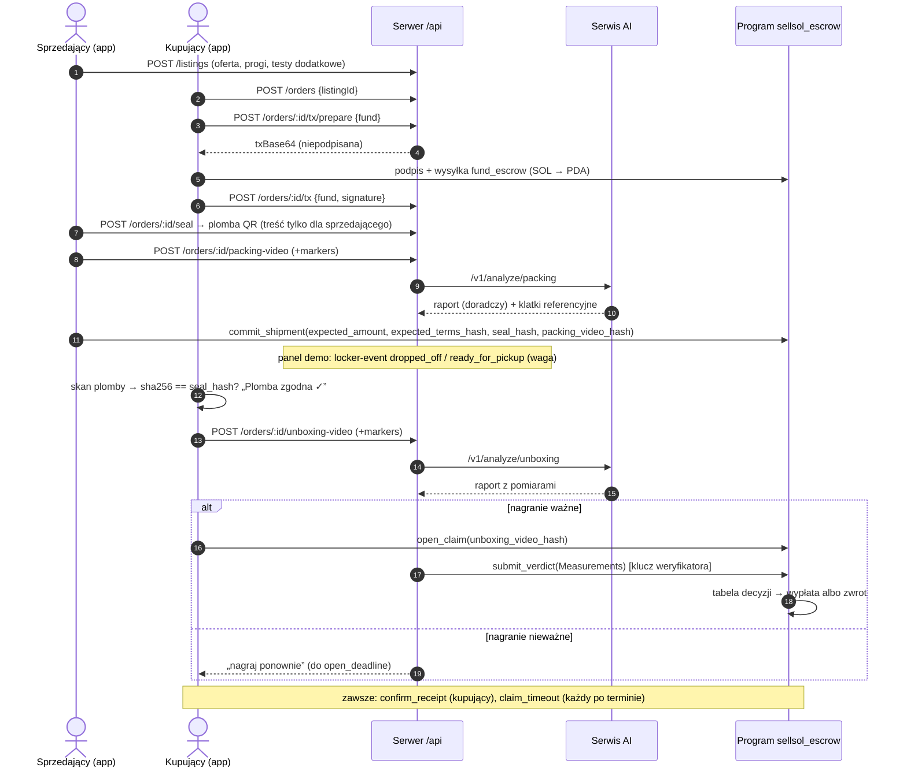

# KONTRAKT — SellSol (jedno źródło prawdy)

Ten plik definiuje wszystko, co łączy pracę czterech osób: nazwy, typy, endpointy, instrukcje programu, formaty i terminy. Zmienia go tylko Osoba 4, po ustaleniu z zespołem (procedura w `CLAUDE.md`). Jeśli kod i ten plik się różnią, rację ma ten plik, dopóki nie zostanie zmieniony.

**Spis treści**
1. Produkt i gdzie znika pośrednik
2. Przepływ end-to-end
3. Tabela decyzji
4. Statusy (on-chain, API, mapowanie)
5. Program on-chain `sellsol_escrow`
6. Plomba, hasze, helpery i wektory testowe
7. Typy TypeScript (`packages/shared`)
8. REST API
9. Interfejsy aplikacji i przepływy techniczne
10. Serwis AI
11. Dane demo
12. Harmonogram i punkty łączenia
13. Ryzyka i ustalenia
14. Krótkie odpowiedzi dla jury

---

## 1. Produkt i gdzie znika pośrednik

**Dla kogo:** osoby prywatne, które sprzedają i kupują używane ubrania i drobne rzeczy (jak na Vinted czy OLX) i nie znają krypto. Interfejs ukrywa blockchain: wbudowany portfel, ceny w złotówkach obok SOL, proste komunikaty.

**Problem:** kupujący boi się pustej albo podmienionej paczki, sprzedający boi się fałszywej reklamacji („przyszło zniszczone”). Dziś rozstrzyga to platforma: pobiera opłatę za ochronę kupującego, ręcznie rozpatruje spory i może zablokować albo cofnąć pieniądze.

**Co zmieniamy:** pieniądze trzyma program na Solanie. Reguły wypłaty i zwrotu są w kodzie programu i nikt ich nie zmieni w trakcie transakcji. AI dostarcza tylko pomiary (czy plomba się zgadza, czy nagranie jest ciągłe, czy przedmiot pasuje, czy ma wady). Decyzję liczy program (tabela w §3). Jeśli ktoś zniknie, każdy może wywołać `claim_timeout` i środki trafią do właściwej strony według terminów.

---

## 2. Przepływ end-to-end



---

## 3. Tabela decyzji (liczona w programie, w `submit_verdict` i `claim_timeout`)

```
transit_ok = qr_match && seal_intact && package_score >= min_package_score && weight_diff_g <= weight_tol_g
item_ok    = match_score >= min_match_score && !defect_found && tests_passed
```

| Kolejność | Warunek | Wynik | `reason` | Opłata |
|---|---|---|---|---|
| 1 | `!recording_valid` | wypłata sprzedającemu (kupujący nie udowodnił) | `RecordingInvalid` | tak |
| 2 | `!transit_ok` | zwrot kupującemu (podmiana lub naruszenie w transporcie) | `TransitBroken` | tak |
| 3 | `!item_ok` | zwrot kupującemu (inny albo wadliwy przedmiot) | `ItemMismatch` | tak |
| 4 | wszystko OK | wypłata sprzedającemu | `VerifiedOk` | tak |
| — | `confirm_receipt` (kupujący) | wypłata sprzedającemu | `BuyerConfirmed` | tak |
| — | `seller_decline` (sprzedający, przed wysyłką) | zwrot kupującemu | `SellerDeclined` | nie |
| — | `Funded` i `now > ship_deadline` | zwrot kupującemu | `ShipTimeout` | nie |
| — | `Shipped` i `now > open_deadline` | wypłata sprzedającemu | `OpenTimeout` | tak |
| — | `Verifying` i `now > verdict_deadline` (weryfikator zniknął) | zwrot kupującemu | `VerifierTimeout` | tak |

- Opłata `fee_bps` jest pobierana niezależnie od wyniku, więc weryfikator nie ma interesu w żadnej ze stron. Nie pobieramy jej, gdy usługa się nie zaczęła (`SellerDeclined`, `ShipTimeout`).
- Weryfikator może tylko wskazać kupującego albo sprzedającego. Środki nigdy nie trafią do niego.
- Definicje pomiarów są w §10.

---

## 4. Statusy

### 4.1 Status on-chain (`EscrowStatus`)
`Funded → Shipped → Verifying → Released | Refunded`. Dodatkowo: `Funded → Refunded` (`seller_decline` albo `ShipTimeout`), `Shipped → Released` (`confirm_receipt` albo `OpenTimeout`), `Verifying → Released` (`confirm_receipt`).

### 4.2 Status API (`OrderStatus`) i mapowanie
Mapowanie liczy `deriveStatus(chain, offchain)` w `packages/shared`. **Terminalny stan on-chain zawsze wygrywa.**

| `chainStatus` | Dane off-chain | `status` (API) | Co widzi użytkownik |
|---|---|---|---|
| `none` (brak konta) | — | `awaiting_payment` | kupujący: „Zapłać do escrow” |
| `Funded` | brak nagrania pakowania | `funded` | sprzedający: „Spakuj i nagraj” |
| `Funded` | weryfikacja pakowania `processing` | `packing_review` | „AI sprawdza nagranie” |
| `Funded` | weryfikacja pakowania `done` | `ready_to_ship` | sprzedający: „Zatwierdź nadanie” (raport doradczy) |
| `Shipped` | brak zdarzenia `ready_for_pickup` | `shipped` | „Paczka w drodze” |
| `Shipped` | jest `ready_for_pickup` | `delivered` | kupujący: „Otwórz przy paczkomacie” |
| `Shipped` | jest nagranie otwarcia (`processing` albo `done`) | `unboxing_review` | „AI sprawdza” albo „Zgłoś wynik” albo „Nagraj ponownie” |
| `Verifying` | — | `verifying` | „Program rozstrzyga…” |
| `Released` | — | `released` | „Wypłacono sprzedającemu” + powód |
| `Refunded` | — | `refunded` | „Zwrócono kupującemu” + powód |

Raport pakowania jest doradczy: brak `packingOk` nie blokuje `commit_shipment`, aplikacja tylko ostrzega.

---

## 5. Program on-chain `sellsol_escrow` (właściciel: Osoba 2)

Anchor 1.1.2, Rust 1.95. Workspace w `/program`, crate `sellsol_escrow`. Program ID jest ustalony w H0 i wpisany tutaj:

```
PROGRAM_ID = <wpisze Osoba 2 w H0>
```

### 5.1 Konta

```rust
#[account]
#[derive(InitSpace)]
pub struct Config {                 // PDA ["config"]
    pub admin: Pubkey,
    pub verifier: Pubkey,
    pub fee_bps: u16,
    pub fee_wallet: Pubkey,
    pub min_ship_window: i64, pub max_ship_window: i64,   // sekundy
    pub min_open_window: i64, pub max_open_window: i64,
    pub verdict_window: i64,
    pub bump: u8,
}

#[derive(AnchorSerialize, AnchorDeserialize, Clone, Copy, PartialEq, Eq, InitSpace)]
pub enum EscrowStatus { Funded, Shipped, Verifying, Released, Refunded }

#[derive(AnchorSerialize, AnchorDeserialize, Clone, Copy, PartialEq, Eq, InitSpace)]
pub enum Reason { None, BuyerConfirmed, VerifiedOk, RecordingInvalid, TransitBroken,
                  ItemMismatch, ShipTimeout, OpenTimeout, VerifierTimeout, SellerDeclined }

#[derive(AnchorSerialize, AnchorDeserialize, Clone, Copy, InitSpace)]
pub struct Thresholds { pub min_match_score: u8, pub min_package_score: u8, pub weight_tol_g: u16 }

#[derive(AnchorSerialize, AnchorDeserialize, Clone, Copy, InitSpace)]
pub struct Measurements {
    pub recording_valid: bool, pub qr_match: bool, pub seal_intact: bool,
    pub package_score: u8,     // 0–100
    pub weight_diff_g: u16,
    pub match_score: u8,       // 0–100
    pub defect_found: bool, pub tests_passed: bool,
}

#[account]
#[derive(InitSpace)]
pub struct Escrow {                 // PDA ["escrow", order_id]
    pub order_id: [u8; 16],         // bajty UUID
    pub buyer: Pubkey, pub seller: Pubkey,
    pub verifier: Pubkey, pub fee_wallet: Pubkey, pub fee_bps: u16,   // kopie z Config w chwili fund
    pub amount: u64,
    pub terms_hash: [u8; 32],
    pub thresholds: Thresholds,
    pub ship_window: i64, pub open_window: i64, pub verdict_window: i64,
    pub status: EscrowStatus,
    pub created_at: i64,
    pub ship_deadline: i64, pub open_deadline: i64, pub verdict_deadline: i64,  // 0 = jeszcze nie ustawiony
    pub seal_hash: [u8; 32], pub packing_video_hash: [u8; 32], pub unboxing_video_hash: [u8; 32],
    pub measurements: Option<Measurements>,
    pub reason: Reason,
    pub resolved_at: i64,
    pub bump: u8,
}
```

### 5.2 Instrukcje

| Instrukcja | Podpisuje | Argumenty | Warunki | Efekt |
|---|---|---|---|---|
| `initialize_config` | upgrade authority programu (konto ProgramData; fallback: stała `ADMIN`) | `verifier, fee_bps, fee_wallet, min/max_ship_window, min/max_open_window, verdict_window` | config jeszcze nie istnieje, `fee_bps ≤ 1000` | tworzy `Config`; **nie ma instrukcji aktualizacji** |
| `fund_escrow` | kupujący | `order_id: [u8;16], amount: u64, terms_hash: [u8;32], thresholds: Thresholds, ship_window: i64, open_window: i64` | `amount > 0`, kupujący ≠ sprzedający, wyniki ≤ 100, okna w granicach `Config` | tworzy `Escrow`, przelew `amount` (CPI system) kupujący → PDA, `Funded`, `ship_deadline = now + ship_window`, kopiuje `verifier/fee_*/verdict_window` |
| `seller_decline` | sprzedający | — | `Funded` | zwrot całości, `Refunded`, `SellerDeclined` |
| `commit_shipment` | sprzedający | `expected_amount: u64, expected_terms_hash: [u8;32], seal_hash: [u8;32], packing_video_hash: [u8;32]` | `Funded`, `now ≤ ship_deadline`, `amount == expected_amount`, `terms_hash == expected_terms_hash`, hasze ≠ 0 | **akceptacja warunków przez sprzedającego**, zapis haszy, `Shipped`, `open_deadline = now + open_window` |
| `confirm_receipt` | kupujący | — | `Shipped` albo `Verifying` | wypłata, `Released`, `BuyerConfirmed` |
| `open_claim` | kupujący | `unboxing_video_hash: [u8;32]` | `Shipped`, `now ≤ open_deadline`, hasz ≠ 0 | zapis haszu dowodu, `Verifying`, `verdict_deadline = now + verdict_window` |
| `submit_verdict` | tylko `escrow.verifier` | `m: Measurements` | `Verifying`, `now ≤ verdict_deadline`, wyniki ≤ 100 | zapis pomiarów, tabela z §3 → `Released`/`Refunded` |
| `claim_timeout` | każdy (cranker płaci fee sieci) | — | jeden z trzech warunków timeoutu z §3 | wypłata albo zwrot według §3 |

Konta odbiorców (`buyer`, `seller`, `fee_wallet`) są zawsze przekazywane jako `mut` z ograniczeniem `address = escrow.<pole>`.

### 5.3 Wypłata
- `fee = amount * fee_bps / 10_000` (u128, w dół). Zwycięzca dostaje `amount - fee`, `fee_wallet` dostaje `fee`. Gdy opłaty nie ma, zwycięzca dostaje całość.
- Lamporty przesuwamy **bezpośrednio** z PDA (`sub_lamports` / `add_lamports`), nie przez `system_program::transfer`, bo PDA ma dane. Rent zostaje w PDA.
- **Kont escrow nie zamykamy.** Pomiary i hasze zostają on-chain jako publiczny dowód.

### 5.4 Błędy i eventy
Błędy (`ErrorCode`): `InvalidStatus, DeadlinePassed, DeadlineNotReached, Unauthorized, UnauthorizedVerifier, InvalidAmount, InvalidScore, InvalidWindow, SameParty, AmountMismatch, TermsMismatch, EmptyHash`.

Eventy: `EscrowFunded{order_id, buyer, seller, amount}`, `ShipmentCommitted{order_id, seal_hash}`, `ClaimOpened{order_id, unboxing_video_hash}`, `VerdictSubmitted{order_id, measurements}`, `EscrowResolved{order_id, released: bool, reason, payout, fee}`.

### 5.5 Konfiguracja demo (devnet)
`fee_bps = 100` (1%), `min_ship_window = min_open_window = 60`, `max_* = 1_209_600` (14 dni), `verdict_window = 600`. Zamówienia demo mają okna po 1800 s. Do pokazania timeoutu: zamówienie z oknem 60–120 s.

### 5.6 SDK `packages/sdk` (Osoba 2; używa go tylko serwer i skrypty, Node)

```ts
export const PROGRAM_ID: PublicKey;
export class SellSolSdk {
  constructor(opts: { connection: Connection; programId?: PublicKey });
  // Niepodpisane transakcje dla POST /orders/:id/tx/prepare (feePayer = użytkownik, świeży blockhash)
  buildFundEscrowTx(p: { orderId: string; buyer: PublicKey; seller: PublicKey; amountLamports: string;
                         termsHash: string; thresholds: Thresholds; windows: Windows }): Promise<Transaction>;
  buildSellerDeclineTx(p: { orderId: string; seller: PublicKey }): Promise<Transaction>;
  buildCommitShipmentTx(p: { orderId: string; seller: PublicKey; expectedAmountLamports: string;
                             expectedTermsHash: string; sealHash: string; packingVideoHash: string }): Promise<Transaction>;
  buildConfirmReceiptTx(p: { orderId: string; buyer: PublicKey }): Promise<Transaction>;
  buildOpenClaimTx(p: { orderId: string; buyer: PublicKey; unboxingVideoHash: string }): Promise<Transaction>;
  buildClaimTimeoutTx(p: { orderId: string; cranker: PublicKey }): Promise<Transaction>;
  // Wysyłane przez serwer własnym kluczem
  submitVerdict(p: { orderId: string; verifier: Keypair; measurements: Measurements }): Promise<string>;
  claimTimeout(p: { orderId: string; cranker: Keypair }): Promise<string>;
  initializeConfig(p: { admin: Keypair; verifier: PublicKey; feeBps: number; feeWallet: PublicKey;
                        bounds: ConfigBounds }): Promise<string>;
  // Odczyt
  getEscrow(orderId: string): Promise<EscrowState | null>;
  getConfig(): Promise<ConfigState | null>;
}
export function serializeUnsigned(tx: Transaction): string; // base64, requireAllSignatures: false
```
Typy `Thresholds`, `Windows`, `Measurements`, `EscrowState` są w §7. Hasze w SDK to hex. Konwersja na `[u8;32]` odbywa się w SDK.

---

## 6. Plomba, hasze, helpery i wektory testowe

| Co | Definicja |
|---|---|
| Treść QR plomby | `SELLSOL1\|<orderId>\|<nonce>`, nonce = 16 losowych bajtów jako 32 znaki hex lowercase |
| `seal_hash` | `sha256(utf8(payload))`, 64 znaki hex lowercase |
| Krótki kod na plombie | `SS-` + nonce[0..4] wielkimi literami + `-` + nonce[4..6] wielkimi literami, np. `SS-DB5D-2C` |
| `order_id` (seed PDA) | 16 bajtów UUID (hex bez myślników) |
| PDA escrow | `findProgramAddress(["escrow", uuidBytes], PROGRAM_ID)` |
| PDA config | `findProgramAddress(["config"], PROGRAM_ID)` |
| `terms_hash` | `sha256(canonicalJson(terms))`, gdzie `terms = {listingId, priceLamports, sellerWallet, thresholds, windows, extraTests: [opisy], declaredWeightG}`, a canonical JSON to klucze posortowane rekurencyjnie, bez spacji, UTF-8 |
| Hasz wideo | `sha256` pliku, liczy serwer przy uploadzie (nie telefon) |
| Link do Explorera | `https://explorer.solana.com/tx/<sig>?cluster=devnet`, konto: `.../address/<pda>?cluster=devnet` |

**Treść QR (`qrPayload`) dostaje tylko sprzedający.** Kupujący widzi `sealHash` i `shortCode`, żeby nie dało się wydrukować kopii plomby przed doręczeniem.

Helpery w `packages/shared/src/helpers.ts` (Osoba 4 z Osobą 2; sha256 przez `@noble/hashes`, bo działa i w RN, i w Node): `uuidToBytes`, `escrowPda`, `configPda`, `sealPayload`, `sealHash`, `shortCode`, `canonicalJson`, `termsHash`, `explorerTxUrl`, `explorerAddressUrl`, `deriveStatus`, `evaluateVerdict` (kopia tabeli z §3 dla mocków i podglądu; o pieniądzach decyduje program) oraz `fakeChain.applyAction` (symulacja programu dla trybów mock).

**Wektory testowe (muszą przejść w `packages/shared` i w testach programu):**
```
uuidToBytes("5e115e11-de00-4000-8000-000000000001")
  = [94,17,94,17,222,0,64,0,128,0,0,0,0,0,0,1]

sealHash("SELLSOL1|5e115e11-de00-4000-8000-000000000001|00112233445566778899aabbccddeeff")
  = 5c18f2ae2a29fb45d6d08ba1aea8407e30e573698f7bf5bff76261b70b1014b4

canonicalJson(terms) =
{"declaredWeightG":900,"extraTests":["Pokaż metkę z rozmiarem M"],"listingId":"l-kurtka-levis","priceLamports":"200000000","sellerWallet":"SELLERWALLET111","thresholds":{"minMatchScore":70,"minPackageScore":60,"weightTolG":150},"windows":{"openWindowSecs":1800,"shipWindowSecs":1800}}
termsHash(terms) = 856b0ef39c7714245dc3d09939f91ebccdbab9621f63d277a14ba75b83f37df6

escrowPda("5e115e11-de00-4000-8000-000000000001") = <wpisze Osoba 2 po ustaleniu PROGRAM_ID>
```

---

## 7. Typy TypeScript (`packages/shared/src/types.ts`, plus schematy zod o tych samych nazwach z sufiksem `Schema`)

```ts
export type Lamports = string;   // u64 jako string dziesiętny
export type Unix = number;       // sekundy
export type Hex32 = string;      // 64 znaki hex lowercase
export type Base58 = string;
export type Role = 'buyer' | 'seller';
export type Cluster = 'devnet' | 'localnet' | 'mock';

export interface User { id: string; email: string; name: string; walletAddress: Base58 | null; createdAt: Unix }
export interface Category { id: string; slug: string; name: string; icon: string }
export type Condition = 'nowy' | 'jak_nowy' | 'dobry' | 'widoczne_slady';
export interface ExtraTest { id: string; description: string }            // np. "Pokaż metkę z rozmiarem M"
export interface Thresholds { minMatchScore: number; minPackageScore: number; weightTolG: number }
export interface Windows { shipWindowSecs: number; openWindowSecs: number }

export interface Listing {
  id: string; sellerId: string;
  seller: { id: string; name: string; walletAddress: Base58 | null };
  title: string; description: string; categoryId: string; condition: Condition;
  size?: string; brand?: string;
  priceLamports: Lamports; pricePln: number;                 // pricePln poglądowo (stały kurs demo)
  photos: string[];                                          // URL-e albo require() w mocku
  declaredWeightG: number; dimensionsCm: { l: number; w: number; h: number };
  extraTests: ExtraTest[]; thresholds: Thresholds; windows: Windows;
  status: 'active' | 'reserved' | 'sold'; createdAt: Unix;
}
export type CreateListingInput = Omit<Listing, 'id' | 'sellerId' | 'seller' | 'status' | 'createdAt' | 'pricePln'>;

export type OrderStatus = 'awaiting_payment' | 'funded' | 'packing_review' | 'ready_to_ship'
  | 'shipped' | 'delivered' | 'unboxing_review' | 'verifying' | 'released' | 'refunded';
export type ChainStatus = 'none' | 'Funded' | 'Shipped' | 'Verifying' | 'Released' | 'Refunded';
export type TxAction = 'fund' | 'seller_decline' | 'commit_shipment' | 'confirm_receipt'
  | 'open_claim' | 'claim_timeout' | 'submit_verdict';           // submit_verdict wysyła tylko serwer
export type OutcomeReason = 'BuyerConfirmed' | 'VerifiedOk' | 'RecordingInvalid' | 'TransitBroken'
  | 'ItemMismatch' | 'ShipTimeout' | 'OpenTimeout' | 'VerifierTimeout' | 'SellerDeclined';
export type DemoScenario = 'ok' | 'defect' | 'swap' | 'invalid_recording';

export interface Measurements {
  recordingValid: boolean; qrMatch: boolean; sealIntact: boolean;
  packageScore: number; weightDiffG: number; matchScore: number;
  defectFound: boolean; testsPassed: boolean;
}
export interface Seal { qrPayload?: string; sealHash: Hex32; shortCode: string }   // qrPayload tylko dla sprzedającego
export interface Markers { sealShownMs?: number; openStartMs?: number; productShownMs?: number; defectShownMs?: number }
export interface LockerEvent { type: 'dropped_off' | 'ready_for_pickup'; lockerId: string; weightG: number; at: Unix }
export interface TxRef { action: TxAction; signature: string; explorerUrl: string; at: Unix }
export interface TimelineEvent { at: Unix; type: string; label: string; txSignature?: string }  // label po polsku

export interface Order {
  id: string;                                   // UUID = order_id w programie
  listing: Listing; buyerId: string; sellerId: string;
  buyerWallet: Base58; sellerWallet: Base58; amountLamports: Lamports;
  escrowPda: Base58; programId: Base58; cluster: Cluster;
  status: OrderStatus; chainStatus: ChainStatus;
  termsHash: Hex32; thresholds: Thresholds; windows: Windows;
  shipDeadline: Unix | null; openDeadline: Unix | null; verdictDeadline: Unix | null;
  seal: Seal | null;
  packingVideoHash: Hex32 | null; unboxingVideoHash: Hex32 | null;
  packingVerificationId: string | null; unboxingVerificationId: string | null;
  lockerEvents: LockerEvent[];
  measurements: Measurements | null; outcomeReason: OutcomeReason | null;
  txs: TxRef[]; timeline: TimelineEvent[]; createdAt: Unix;
}

export interface Keyframe { ms: number; url: string; label: string }
export interface Defect { label: string; severity: 'minor' | 'major'; frameMs: number; confidence: number }
export interface ExtraTestResult { testId: string; passed: boolean; note: string; frameMs?: number }
export interface VerificationReport {
  kind: 'packing' | 'unboxing'; orderId: string; videoSha256: Hex32; durationMs: number;
  seal: { detected: boolean; payloadMatch: boolean; firstSeenMs: number | null;
          lastSeenSealedMs: number | null; intact: boolean | null };
  continuity: { ok: boolean; sceneCutsMs: number[]; timestampGaps: { fromMs: number; toMs: number }[];
                maxSealGapMs: number; issues: string[] };
  productVisible: boolean;
  defects: Defect[]; extraTests: ExtraTestResult[];
  recordingValid: boolean;
  packingOk: boolean | null;                                   // tylko packing
  measurements: Omit<Measurements, 'weightDiffG'> | null;      // tylko unboxing; weightDiffG dokłada serwer
  keyframes: Keyframe[]; reasons: string[];                    // reasons po polsku
  engine: { version: string; llm: string | null; processingMs: number };
}
export interface Verification {
  id: string; orderId: string; kind: 'packing' | 'unboxing';
  status: 'processing' | 'done' | 'failed'; report: VerificationReport | null;
  error?: string; createdAt: Unix;
}

export interface EscrowState {                                 // odczyt konta przez SDK
  orderId: string; buyer: Base58; seller: Base58; verifier: Base58; feeWallet: Base58; feeBps: number;
  amountLamports: Lamports; termsHash: Hex32; thresholds: Thresholds;
  windows: Windows & { verdictWindowSecs: number };
  status: Exclude<ChainStatus, 'none'>; createdAt: Unix;
  shipDeadline: Unix; openDeadline: Unix | null; verdictDeadline: Unix | null;
  sealHash: Hex32 | null; packingVideoHash: Hex32 | null; unboxingVideoHash: Hex32 | null;
  measurements: Measurements | null; reason: OutcomeReason | null; resolvedAt: Unix | null;
}
export interface ConfigBounds { minShipWindow: number; maxShipWindow: number; minOpenWindow: number;
                                maxOpenWindow: number; verdictWindow: number }
export interface ConfigState extends ConfigBounds { admin: Base58; verifier: Base58; feeBps: number; feeWallet: Base58 }

export interface LocalFile { uri: string; name: string; mimeType: string }
export interface UploadResult { url: string; sha256: Hex32; size: number; mimeType: string }
export interface PreparedTx { action: TxAction; txBase64: string; programId: Base58; cluster: Cluster }
export interface ApiError { error: { code: ErrorCode; message: string } }
export type ErrorCode = 'UNAUTHORIZED' | 'FORBIDDEN' | 'NOT_FOUND' | 'VALIDATION' | 'INVALID_STATE'
  | 'RECORDING_INVALID' | 'TX_NOT_CONFIRMED' | 'CHAIN_ERROR' | 'AI_ERROR';
```

Stałe (`packages/shared/src/constants.ts`): `SOL_PLN_DEMO_RATE = 600` (kurs poglądowy), `DEFAULT_THRESHOLDS = { minMatchScore: 70, minPackageScore: 60, weightTolG: 150 }`, `DEFAULT_WINDOWS = { shipWindowSecs: 1800, openWindowSecs: 1800 }`, `POLL_MS = 2000`, porty z `CLAUDE.md`.

---

## 8. REST API

Konwencje:
- Baza `EXPO_PUBLIC_API_URL` (domyślnie `http://localhost:4000`), prefiks `/api`, JSON.
- Autoryzacja: `Authorization: Bearer <token>`.
- Błąd zawsze ma kształt `{ "error": { "code": "...", "message": "..." } }` (kody w §7).
- Lamporty jako string, czasy w unix, hasze jako hex.
- Ten sam kontrakt implementują `MockApiClient` w aplikacji (Osoba 1) i serwer (Osoba 4).

| Metoda i ścieżka | Kto | Body | Odpowiedź | Uwagi |
|---|---|---|---|---|
| `POST /api/auth/register` | publiczny | `{email, password, name}` | `{token, user}` | |
| `POST /api/auth/login` | publiczny | `{email, password}` | `{token, user}` | |
| `GET /api/me` | zalogowany | — | `User` | |
| `PATCH /api/me` | zalogowany | `{walletAddress}` | `User` | przy `CHAIN=devnet` serwer zasila portfel ze skarbca, jeśli saldo < 0.5 SOL |
| `GET /api/categories` | publiczny | — | `Category[]` | |
| `GET /api/listings?categoryId&q` | publiczny | — | `Listing[]` | tylko `active` |
| `GET /api/listings/:id` | publiczny | — | `Listing` | |
| `POST /api/listings` | zalogowany | `CreateListingInput` | `Listing` | brak `thresholds`/`windows` → wartości domyślne |
| `POST /api/uploads` | zalogowany | multipart `file` | `UploadResult` | zdjęcia ofert |
| `POST /api/orders` | zalogowany (≠ sprzedający) | `{listingId}` | `Order` (`awaiting_payment`) | liczy `termsHash`, oferta → `reserved`, przy `DEMO_MODE` `id` z puli plomb (§11) |
| `GET /api/orders?role=buyer\|seller` | zalogowany | — | `Order[]` | |
| `GET /api/orders/:id` | uczestnik | — | `Order` | status odświeżany z chain (cache 2 s) |
| `POST /api/orders/:id/tx/prepare` | uczestnik | `{action}` | `PreparedTx` | warunki akcji poniżej |
| `POST /api/orders/:id/tx` | uczestnik | `{action, signature}` | `Order` | serwer czeka na potwierdzenie i **ponownie czyta konto escrow**; nie ufa klientowi |
| `POST /api/orders/:id/seal` | sprzedający, status `funded` | — | `Seal` (z `qrPayload`) | idempotentne |
| `POST /api/orders/:id/packing-video` | sprzedający | multipart `video` + `markers` (string JSON) | `{verificationId, videoSha256}` | analiza w tle |
| `POST /api/orders/:id/locker-event` | uczestnik (panel demo) | `{type, lockerId, weightG}` | `Order` | mock paczkomatu |
| `POST /api/orders/:id/unboxing-video` | kupujący | multipart `video` + `markers`; opcjonalnie nagłówek `X-Demo-Scenario` | `{verificationId, videoSha256}` | nagłówek działa tylko przy `AI=mock` |
| `GET /api/verifications/:id` | uczestnik | — | `Verification` | |
| `GET /api/health` | publiczny | — | `{ok, chain, ai, programId, cluster}` | |
| `GET /media/:sha256` | publiczny | — | plik wideo | bez prefiksu `/api`; każdy może sprawdzić hasz |
| `GET /files/:name` | publiczny | — | zdjęcia, keyframe'y | |

Warunki `tx/prepare` (inaczej `409 INVALID_STATE`):
- `fund`: wołający jest kupującym, ma `walletAddress`, `chainStatus = none`.
- `seller_decline`: sprzedający, `Funded`.
- `commit_shipment`: sprzedający, `Funded`, istnieje plomba i `packingVideoHash`.
- `confirm_receipt`: kupujący, `Shipped` albo `Verifying`.
- `open_claim`: kupujący, `Shipped`, ostatnia weryfikacja otwarcia jest `done` i ma `recordingValid = true` (inaczej `409 RECORDING_INVALID`). Serwer bierze jej `videoSha256`. Ta blokada tylko oszczędza bezużyteczną transakcję; program i tak przyjmie dowolny hasz, a wtedy wyrocznia odpowie `recording_valid = false`.
- `claim_timeout`: dowolny uczestnik, termin minął według stanu on-chain.

Przykład `PreparedTx`:
```json
{ "action": "fund", "txBase64": "AQAAAA…", "programId": "<PROGRAM_ID>", "cluster": "devnet" }
```
W trybie mock `txBase64` ma wartość `"MOCK"`, a mock portfela zwraca podpis `MOCK…`.

Przykład błędu:
```json
{ "error": { "code": "INVALID_STATE", "message": "Zamówienie nie jest w stanie Funded" } }
```

---

## 9. Interfejsy aplikacji i przepływy techniczne

### 9.1 `ApiClient` (`packages/shared/src/api.ts`)
```ts
export interface ApiClient {
  setToken(token: string | null): void;
  register(i: { email: string; password: string; name: string }): Promise<{ token: string; user: User }>;
  login(i: { email: string; password: string }): Promise<{ token: string; user: User }>;
  me(): Promise<User>;
  updateMe(i: { walletAddress: Base58 }): Promise<User>;
  categories(): Promise<Category[]>;
  listings(q?: { categoryId?: string; q?: string }): Promise<Listing[]>;
  listing(id: string): Promise<Listing>;
  createListing(i: CreateListingInput): Promise<Listing>;
  upload(file: LocalFile): Promise<UploadResult>;
  createOrder(i: { listingId: string }): Promise<Order>;
  orders(q: { role: Role }): Promise<Order[]>;
  order(id: string): Promise<Order>;
  prepareTx(orderId: string, i: { action: TxAction }): Promise<PreparedTx>;
  submitTx(orderId: string, i: { action: TxAction; signature: string }): Promise<Order>;
  createSeal(orderId: string): Promise<Seal>;
  uploadPackingVideo(orderId: string, video: LocalFile, markers: Markers,
                     opts?: { onProgress?: (p: number) => void }): Promise<{ verificationId: string; videoSha256: Hex32 }>;
  lockerEvent(orderId: string, i: { type: LockerEvent['type']; lockerId: string; weightG: number }): Promise<Order>;
  uploadUnboxingVideo(orderId: string, video: LocalFile, markers: Markers,
                      opts?: { onProgress?: (p: number) => void; scenario?: DemoScenario }): Promise<{ verificationId: string; videoSha256: Hex32 }>;
  verification(id: string): Promise<Verification>;
}
```
Implementacje: `MockApiClient` (Osoba 1, w pamięci, dane z `packages/shared/fixtures`, opóźnienia 300–1500 ms, `fakeChain`) oraz `HttpApiClient` (Osoba 1, fetch według §8, upload przez `expo-file-system` z postępem). Wybór przez `EXPO_PUBLIC_API_MODE=mock|http`.

### 9.2 Portfel (`app/src/wallet/types.ts`)
```ts
export interface AppWallet {
  address(): Promise<Base58>;
  balanceLamports(): Promise<Lamports>;
  signAndSend(prepared: PreparedTx): Promise<string>;      // zwraca podpis transakcji
  useDemoIdentity(role: Role): Promise<void>;              // klucze demo kupującego/sprzedającego
}
```
`MockWallet` robi Osoba 1, `RealWallet` (`app/src/wallet/realWallet.ts`) robi Osoba 4. Wybór przez `EXPO_PUBLIC_WALLET_MODE=mock|real`.

### 9.3 Przepływ transakcji (real)
1. `api.prepareTx(orderId, {action})`. Serwer buduje transakcję przez SDK z `feePayer` = portfel użytkownika i świeżym blockhashem.
2. `RealWallet.signAndSend`: `Transaction.from(base64)` → sprawdza, że każda instrukcja celuje w `PROGRAM_ID` albo System Program (inaczej odmowa) → `partialSign(keypair)` → `connection.sendRawTransaction` → `confirmTransaction`.
3. `api.submitTx(orderId, {action, signature})`. Serwer pobiera transakcję, czyta konto escrow i zwraca `Order` z nowym `chainStatus`.
4. Wygasły blockhash: aplikacja ponawia od kroku 1.

### 9.4 Przepływ nagrania (pakowanie i otwarcie)
1. **Osobny krok skanu QR** (`CameraView` z `barcodeScannerSettings: { barcodeTypes: ['qr'] }`). Przy otwarciu aplikacja liczy `sealHash(skan)` przez `expo-crypto` i porównuje z `order.seal.sealHash` → „Plomba zgodna z transakcją ✓” albo ostrzeżenie.
2. Nagrywanie: `CameraView mode="video"`, `recordAsync({ maxDuration: 60 })`, jakość `720p`, bitrate ok. 1.5 Mb/s (Android), bez dźwięku (`mute`). Użytkownik tapie kolejne kroki, a aplikacja zapisuje `markers` w ms od startu nagrania.
   - Pakowanie: „Pokaż przedmiot” → `productShownMs`, „Wkładam do paczki”, „Naklejam plombę” → `sealShownMs`.
   - Otwarcie: „Pokazuję plombę” → `sealShownMs`, „Otwieram” → `openStartMs`, „Pokazuję przedmiot” → `productShownMs`, opcjonalnie „Pokazuję wadę” → `defectShownMs`.
3. Upload multipart z paskiem postępu. Serwer zapisuje plik strumieniowo, liczy sha256 i zwraca `videoSha256` (to ten hasz trafia on-chain).
4. Aplikacja odpytuje `GET /orders/:id` i `GET /verifications/:id` co 2 s.

### 9.5 Wyrocznia (serwer, Osoba 4)
Po `submitTx {action: open_claim}` serwer czyta escrow (`Verifying`, `unboxing_video_hash`). Szuka raportu otwarcia z tym `videoSha256`:
- Jest raport: `measurements` z raportu + `weightDiffG = |dropped_off.weightG − ready_for_pickup.weightG|` (brak zdarzeń → 0) → `sdk.submitVerdict(...)` kluczem weryfikatora.
- Nie ma raportu z tym haszem: wysyła `recording_valid = false`. Nie czeka, bo inaczej `VerifierTimeout` dawałby kupującemu zwrot za dowolny hasz.

Potem ponowny odczyt konta i aktualizacja `Order`.

---

## 10. Serwis AI (właściciel: Osoba 3)

Zasada: serwis zwraca **tylko pomiary i uzasadnienia**, nigdy „wypłać” ani „zwróć”.

| Endpoint | Body (multipart) | Odpowiedź |
|---|---|---|
| `GET /health` | — | `{ok, llm: "claude-opus-5-5" \| null, version}` |
| `POST /v1/analyze/packing` | `video`, `order_id`, `expected_qr`, `markers` (JSON), `listing_photos` (JSON lista URL-i), `extra_tests` (JSON `[{id, description}]`) | `VerificationReport` (`kind: "packing"`) |
| `POST /v1/analyze/unboxing` | jak wyżej + opcjonalnie `packing_video_url` (gdy brak klatek referencyjnych) + `listing_description` | `VerificationReport` (`kind: "unboxing"`) |
| `GET /v1/keyframes/{order_id}/{name}.jpg` | — | klatka (serwer kopiuje je pod `/files/`) |

Odpowiedź przychodzi synchronicznie (cel < 30 s na 60 s wideo, timeout po stronie serwera 90 s). JSON ma klucze w camelCase, zgodne z §7. Klatki referencyjne pakowania (produkt i zaklejona paczka) są zapisywane w `AI_DATA_DIR/refs/<order_id>/`.

Definicje pomiarów (otwarcie):
| Pomiar | Jak liczony |
|---|---|
| `recordingValid` | plomba odczytana przed `openStartMs` (albo w pierwszych 10 s) **i** brak cięć **i** brak dziur w znacznikach czasu > 500 ms **i** `maxSealGapMs ≤ 2000` w fazie zaklejonej **i** długość ≥ 8 s |
| `qrMatch` | odczytano `expected_qr` i nie odczytano innej plomby `SELLSOL1\|…` |
| `sealIntact` | Claude vision: plomba nienaruszona na początku (fallback: `qrMatch`) |
| `packageScore` | Claude vision: zaklejona paczka z końca pakowania vs z początku otwarcia, 0–100 (fallback: podobieństwo histogramów HSV) |
| `matchScore` | Claude vision: przedmiot (zdjęcia oferty + klatki z pakowania) vs klatki z otwarcia, 0–100 (fallback: HSV) |
| `defectFound` | jest wada `major` z `confidence ≥ 0.6`, nieujawniona w opisie i stanie oferty |
| `testsPassed` | wszystkie testy dodatkowe zaliczone (brak testów → `true`) |

Pakowanie: `packingOk = brak cięć i dziur && plomba odczytana i zgodna && productVisible`.

---

## 11. Dane demo (wspólne dla mocka, seedu serwera i nagrań)

Pliki w `packages/shared/fixtures/` (właściciel: Osoba 1; każdy przechodzi walidację schematów zod z §7):
| Plik | Zawartość | Kto używa |
|---|---|---|
| `users.json` | `u-ania`, `u-bartek` (adresy portfeli demo od Osoby 4) | mock, seed serwera |
| `categories.json` | 6 kategorii | mock, seed serwera |
| `listings.json` | ok. 12 ofert, w tym `l-kurtka-levis`; zdjęcia jako `/files/<nazwa>.jpg` | mock, seed serwera |
| `photos/*.jpg` | zdjęcia ofert (przedmiot z nagrań Osoby 3 dla `l-kurtka-levis`) | mock (mapa `require`), serwer (`/files/`) |
| `orders.json` | zamówienia w różnych statusach, UUID spoza puli plomb | **tylko mock** (serwer ich nie seeduje) |
| `seal-pool.json` | 10 plomb z tabeli niżej (`orderId`, `nonce`, `qrPayload`, `shortCode`, `sealHash`) | mock, serwer (`DEMO_MODE`), druk plomb |
| `reports.json` | raport pakowania + 4 raporty otwarcia (`ok`, `defect`, `swap`, `invalid_recording`) jako `VerificationReport` | mock w aplikacji, `mockAi` na serwerze |

Użytkownicy (hasło `demo1234`):
| id | email | imię | rola w demo |
|---|---|---|---|
| `u-ania` | `ania@demo.pl` | Ania Kowalska | sprzedająca |
| `u-bartek` | `bartek@demo.pl` | Bartek Nowak | kupujący |

Klucze portfeli demo (devnet) generuje Osoba 4 w H0 (poza git) i przekazuje Osobie 1 tylko adresy publiczne do fixtures.

Kategorie: `odziez-damska` (Odzież damska, 👗), `odziez-meska` (Odzież męska, 👔), `buty` (Buty, 👟), `dodatki` (Torebki i dodatki, 👜), `dzieci` (Dla dzieci, 🧸), `elektronika` (Elektronika, 📱).

Oferta główna demo: `l-kurtka-levis` — „Kurtka jeansowa Levi's, rozmiar M”, sprzedająca `u-ania`, `priceLamports: "200000000"` (0.2 SOL, ok. 120 zł), `condition: "dobry"`, `declaredWeightG: 900`, test dodatkowy `t1` „Pokaż metkę z rozmiarem M”, progi i okna domyślne. Do tego ok. 11 ofert w pozostałych kategoriach, z cenami 0.05–0.5 SOL (oszczędzamy devnet SOL).

**Pula 10 plomb demo** (drukujemy przed demo; przy `DEMO_MODE` serwer i mock przydzielają kolejne wolne `orderId`; Osoba 3 nagrywa fixtures na plombach 01–05):

| # | orderId | nonce | shortCode | sealHash |
|---|---|---|---|---|
| 01 | `5e115e11-de00-4000-8000-000000000001` | `db5d2cfddd7dd2af2dac6cb188a93966` | `SS-DB5D-2C` | `95fda3bc72140eab523408669378dfd6306be973bb62f3fd2692703e109b55f7` |
| 02 | `5e115e11-de00-4000-8000-000000000002` | `410d1fd00fe42083fa47d3745909769d` | `SS-410D-1F` | `b77ae91acb8da03e0f24a64b8aabff0be574222943f52e69af48ef368f8bb723` |
| 03 | `5e115e11-de00-4000-8000-000000000003` | `dafba90492deb44092736088c080bc1d` | `SS-DAFB-A9` | `2e6f82fef0cbfb77be228cdc935a4bbeb328f280b49eca5edef41295d4ed183f` |
| 04 | `5e115e11-de00-4000-8000-000000000004` | `3f8d7e3f431e504fbbb46276c2ae3bbf` | `SS-3F8D-7E` | `fcddd83b04623f91f5599c736b72db0b5a2ffafc2ad0c31c80e27303078bd209` |
| 05 | `5e115e11-de00-4000-8000-000000000005` | `51ffa4b490d9fbe616b79654d96a0a39` | `SS-51FF-A4` | `21a77d367a532b603e04f19d675dfcb96414cc693727b4f625abbf1575f4ce3b` |
| 06 | `5e115e11-de00-4000-8000-000000000006` | `1ce6a14a065d1c69d257f6c20d53d7e5` | `SS-1CE6-A1` | `6dcb4416c06f572288f44a9ee3de488171bafbfbb03b1b701e4eb541e914afc6` |
| 07 | `5e115e11-de00-4000-8000-000000000007` | `06079e592df8730a2c220a067c7842da` | `SS-0607-9E` | `2370613ec9077d295416030ea18b7aad5b99b6bf757109497035bf28365577d8` |
| 08 | `5e115e11-de00-4000-8000-000000000008` | `9c52b15e5dda0cb602638132f3a4fad4` | `SS-9C52-B1` | `2c38785e9a5d87318191bf7021bbc7ac9678c4573f7b07afb8d4c3ac34ba169b` |
| 09 | `5e115e11-de00-4000-8000-000000000009` | `8ce0e9e3d523049cf65df578c62b1cb5` | `SS-8CE0-E9` | `d4b3973cbf9edb08fc135e881376b440a830943108e435fa0d140883d4739dfa` |
| 10 | `5e115e11-de00-4000-8000-000000000010` | `c6dab28837a857b76f40387b0a04a42e` | `SS-C6DA-B2` | `4f6987909bcfb633d6d1f46097403bdbdb7d3a2a362b57c905a6326220bbecba` |

Treść QR = `SELLSOL1|<orderId>|<nonce>`. Konto escrow dla danego `orderId` można założyć on-chain tylko raz. Po każdej próbie generalnej przechodzimy do kolejnej plomby albo dodajemy nowe do puli (zmiana kontraktu).

Nagrania testowe Osoby 3 (wspólny dysk, nie git; opis i oczekiwane wyniki w `ai/samples/README.md`):
| Plik | Plomba | Oczekiwane |
|---|---|---|
| `packing_ok.mp4` | 01 | `packingOk = true` |
| `unboxing_ok.mp4` | 01 | `recordingValid`, `qrMatch`, `matchScore ≥ 70`, brak wad, test `t1` zaliczony |
| `unboxing_defect.mp4` | 01 | jak wyżej, ale `defectFound = true` (np. plama, dziura) |
| `unboxing_swap.mp4` | 02 na innej paczce albo inny przedmiot | `qrMatch = false` albo niski `packageScore`/`matchScore` |
| `unboxing_invalid.mp4` | 01 | `recordingValid = false` (paczka wychodzi z kadru > 2 s albo cięcie) |

Scenariusze demo w trybach mock (`DemoScenario`) odpowiadają nagraniom: `ok`, `defect`, `swap`, `invalid_recording`.

---

## 12. Harmonogram i punkty łączenia (H = 3.10 23:00)

| Kiedy | Od → do | Co | Jak sprawdzić |
|---|---|---|---|
| H+1 | O4 → wszyscy | szkielet repo, `packages/shared` (typy, zod, `ApiClient`, helpery + wektory z §6) | `npm test -w packages/shared` zielone |
| H+1 | O2 → wszyscy | `PROGRAM_ID` wpisany w §5 | `declare_id!` = Anchor.toml = KONTRAKT |
| H+1 | O4 → O2 | klucze publiczne weryfikatora, skarbca, `fee_wallet` | wpisane w `scripts/devnet.md` |
| H+1 | O4 | test sieci: telefon ↔ laptop przez hotspot i tunel | telefon otwiera `/api/health` |
| H+2 | O4 → O1 | przepis na polyfille ze spike'a RN + Solana | Expo Go: keypair, saldo, przelew devnet |
| H+2 | O4 → O1 | `fakeChain`, `evaluateVerdict`, `deriveStatus` w shared | testy jednostkowe |
| H+2 | O1 → O3, O4 | fixtures (JSON) + PDF z 10 plombami do druku | plomby wydrukowane |
| H+3 | O2 → O4 | zamrożone konta i sygnatury instrukcji, IDL i typy w `packages/sdk/idl`, sygnatury SDK (mogą być stuby) | `tsc` w `packages/sdk` przechodzi |
| H+3 | O4 → O1 | serwer `CHAIN=mock AI=mock` pod adresem tunelu | `scripts/contract-test.ts` zielony |
| H+4 | O3 → wszyscy | 5 nagrań testowych + oczekiwane wyniki | pliki na wspólnym dysku |
| **H+6 (M1)** | wszyscy | O1: klikalny cały flow w aplikacji (mock). O2: testy wszystkich wierszy tabeli. O3: CLI `analyze` na nagraniach. O4: serwer mock kompletny | demo wewnętrzne na kanale |
| H+8 | O3 → O4 | serwis AI po HTTP (adres) | `curl` `/v1/analyze/unboxing` na `unboxing_ok.mp4` |
| H+10 | O2 → O4 | deploy devnet, `initialize_config`, SDK działa | `inspect-escrow` na testowym escrow |
| **H+12 (M2)** | wszyscy | O4: serwer `CHAIN=devnet AI=http` + wyrocznia. O1: landing online + **wideo zapasowe z mocka**. O4: APK plan B | pierwsza transakcja w Explorerze |
| **H+16 (M3)** | O1 + O4 | aplikacja na `HttpApiClient` + `RealWallet`; e2e 4 scenariusze + timeout | 2 telefony, 2 portfele, linki w Explorerze |
| H+18 | wszyscy | **zamrożenie funkcji**, tylko poprawki | — |
| H+19, H+20 | wszyscy | 2 pełne próby demo (hotspot, 2 telefony) | lista kontrolna z `docs/demo-script.md` |
| H+20 | O2 | deck PDF ≤ 10 slajdów, uzasadnienie, Q&A | PDF gotowy |
| H+21 | O1 + O4 | wideo finalne ≤ 3 min (publiczny link) | link działa w trybie incognito |
| **H+22** | O4 | zgłoszenie na HackTribe | potwierdzenie zgłoszenia |

---

## 13. Ryzyka i ustalenia

| Ryzyko | Ustalenie | Kto |
|---|---|---|
| Anchor TS (`Wallet`/`NodeWallet`) nie działa w RN | Anchor tylko na serwerze. Aplikacja używa samego `@solana/web3.js` do podpisu przygotowanej transakcji. Plan B: SDK w RN | O4, O2 |
| Polyfille web3.js w Expo Go | spike na telefonie demo w H0–H2: `react-native-get-random-values`, `buffer`, ewentualnie `react-native-url-polyfill` | O4 |
| Skan QR i nagrywanie naraz w expo-camera | skan to osobny krok przed nagraniem; QR z wideo czyta AI | O1, O3 |
| Duże pliki wideo | 720p, ok. 1.5 Mb/s, bez dźwięku, max 60 s; upload z postępem; hasz liczy serwer | O1, O4 |
| Wi-Fi na miejscu blokuje ruch między urządzeniami | własny hotspot + `cloudflared tunnel` albo hosting (Railway/Fly); test w H+1 | O4 |
| Limity faucetu devnet | zasilić deployera i skarbiec przed startem (faucet z logowaniem GitHub); serwer zasila portfele ze skarbca; RPC Helius albo QuickNode | O4, O2 |
| Wersja Expo Go ≠ SDK projektu | `create-expo-app@latest` + najnowsze Expo Go na telefonach; plan B: APK preview do H+12 | O1, O4 |
| Rozjazd IDL | zamrożenie w H+3, IDL zacommitowany w `packages/sdk/idl`, `/program` poza workspaces | O2 |
| AI za wolne albo niestabilne | 2 fps, 480p, jedno wywołanie Claude; progi strojone na 5 nagraniach; tryb bez klucza | O3 |
| Skopiowana plomba (kurier fotografuje QR) | QR dowodzi tożsamości, nie nienaruszalności → taśma VOID + `packageScore` + waga; treść QR tylko dla sprzedającego | O3, O2 (deck) |
| Front-running `initialize_config` | tylko upgrade authority (ProgramData) albo stała `ADMIN` | O2 |
| Kupujący sam ustala kwotę i progi | `commit_shipment` sprawdza `expected_amount` i `expected_terms_hash`, czyli podpis sprzedającego jest akceptacją; jest też `seller_decline` | O2 |
| Weryfikator znika | `open_claim` → `verdict_deadline` → `VerifierTimeout` = zwrot kupującemu | O2 |
| Fałszywie negatywne `recordingValid` | aplikacja pozwala nagrać ponownie do `open_deadline`; `open_claim` dopiero po ważnym nagraniu | O1, O4 |

---

## 14. Krótkie odpowiedzi dla jury (pełna wersja: `docs/qa-jury.md`, Osoba 2)

- **Gdzie znika pośrednik?** W `submit_verdict` i `claim_timeout` programu `sellsol_escrow`: tabela z §3 decyduje o wypłacie albo zwrocie. Serwer nie może przelać środków; weryfikator może wskazać tylko kupującego albo sprzedającego.
- **Co, jeśli ktoś zniknie?** Sprzedający nie wyśle: `ShipTimeout` → zwrot. Kupujący nie otworzy: `OpenTimeout` → wypłata. Weryfikator nie odpowie: `VerifierTimeout` → zwrot. `claim_timeout` może wywołać każdy. Środki zawsze leżą w PDA danej transakcji.
- **Kto co może?** Kupujący: `fund_escrow`, `confirm_receipt`, `open_claim`. Sprzedający: `commit_shipment`, `seller_decline`. Weryfikator: tylko `submit_verdict`. Każdy: `claim_timeout`. Config nie ma instrukcji aktualizacji. Program na devnecie jest upgradowalny; plan to `--final` albo multisig (Squads) po audycie.
- **Dlaczego blockchain?** Reguły i środki są poza kontrolą platformy: nikt nie zablokuje ani nie cofnie wypłaty, warunki są publiczne, a dowody (hasze nagrań, pomiary) są niezmienne i każdy może je sprawdzić. Koszt transakcji to ułamek grosza zamiast procentu od ceny.
- **Co dalej?** Przepływ zwrotu przedmiotu (ten sam escrow z odwróconymi rolami), wielu niezależnych weryfikatorów (M z N) ze stakingiem, kamery i wagi w paczkomatach jako podpisujące wyrocznie, USDC i BLIK on-ramp, plomby NFC.
